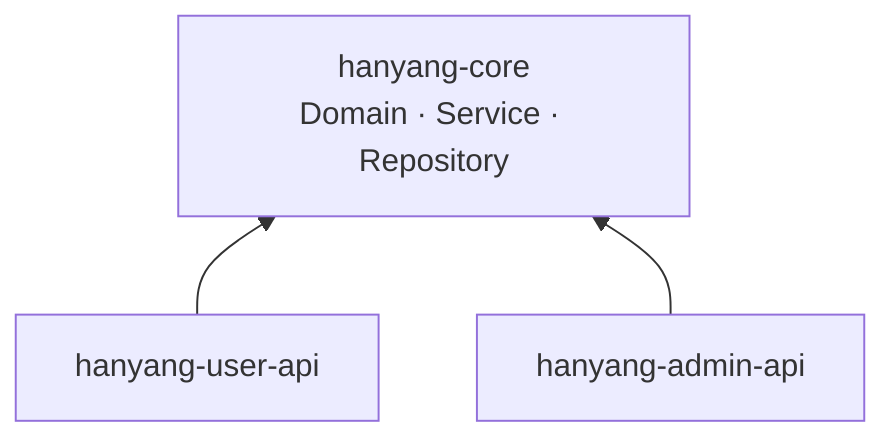
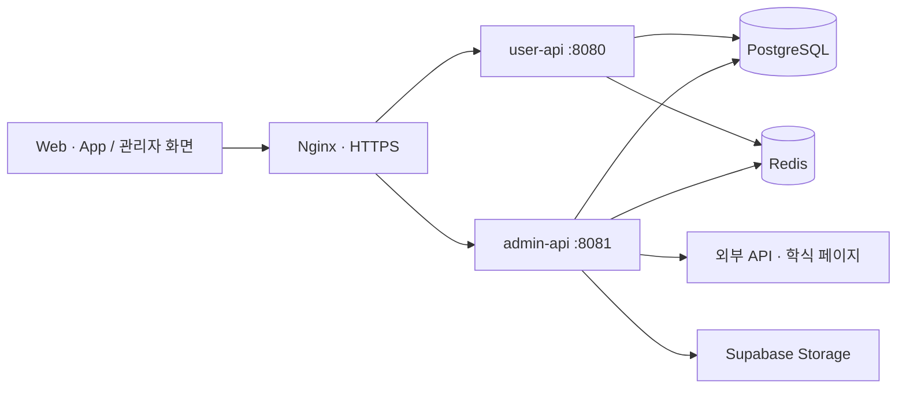
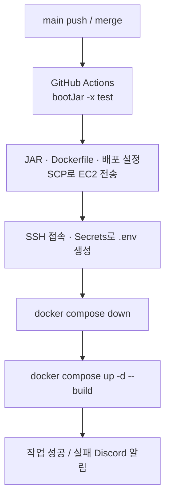

# 하냥냥 Backend 🐾

한양대학교 ERICA 학생을 위한 대학생활 정보 서비스 **하냥냥**의 Spring Boot 백엔드입니다.

**서비스**　[Web](https://hanyang.life) · [App Store](https://apps.apple.com/us/app/%ED%95%98%EB%83%A5%EB%83%A5/id6770033067) · [Google Play](https://play.google.com/store/apps/details?id=com.hanyangnyang.app)  
**API 문서**　[User API](https://api.hanyang.life/swagger-ui/index.html) · [Admin API](https://admin-api.hanyang.life/swagger-ui/index.html)

[주요 기능](#주요-기능) · [백엔드 구조](#백엔드-구조) · [핵심 설계](#핵심-설계) · [데이터 관리](#도메인별-데이터-관리) · [실행 방법](#실행-방법)

## 주요 기능

- 학식 메뉴·가격·운영 시간 조회 및 표시 메뉴 관리
- 셔틀·지하철 시간표 조회 및 관리자 갱신
- 제휴 업체·혜택, 체대 헬스장 운영 시간 관리
- 날씨·미세먼지·자외선 정보와 AI 날씨 브리핑 제공
- 도서관 열람실 잔여석 조회
- 공휴일·학사 일정에 따른 운영 상태 조회
- 음악 추천·검색·좋아요·리액션·차트 및 신고 관리
- 공용 배너와 사용자 피드백 관리

## 백엔드 구조

Gradle 멀티 모듈로 구성하며, 두 실행 애플리케이션이 공통 도메인·서비스·저장소를 사용합니다.



| 모듈 | 역할 |
| --- | --- |
| `hanyang-core` | 도메인 모델, 비즈니스 로직, JPA 저장소, 외부 API 클라이언트, 캐시·스토리지 |
| `hanyang-user-api` | 사용자 조회와 플레이리스트·피드백 등록 API, 포트 8080 |
| `hanyang-admin-api` | 관리자 인증, 데이터 관리, 수집·집계 스케줄러, 포트 8081 |

두 애플리케이션은 EC2의 별도 컨테이너로 실행되고 PostgreSQL과 Redis를 공유합니다. Nginx가 도메인에 따라 요청을 전달합니다.



## 핵심 설계

### 수집 시점과 조회 시점 분리

학식과 날씨는 스케줄러가 미리 수집해 PostgreSQL에 저장합니다. 사용자 요청에서는 저장된 정보를 조회하고, 조회 결과를 Redis에 캐싱합니다. 학식·날씨의 캐시 미스가 매번 스크래핑이나 외부 수집을 발생시키지는 않습니다.

도서관 잔여석은 DB에 저장하지 않고, 관리자 서버가 3분마다 Redis를 갱신합니다. 사용자 서버는 같은 캐시를 조회하며, 캐시가 없을 때는 외부 API로 데이터를 가져옵니다.

### Redis로 두 실행 애플리케이션의 상태 공유

`user-api`와 `admin-api`는 별도 프로세스로 실행되기 때문에 로컬 캐시를 공유할 수 없습니다. 관리자 서버가 갱신한 데이터를 사용자 서버에서도 바로 조회할 수 있도록 Redis를 공용 캐시로 사용합니다.

외부 데이터 수집이 실패하거나 빈 결과가 반환되면 캐시를 갱신하지 않아, 기존의 정상 데이터를 유지합니다.

## 도메인별 데이터 관리

데이터의 변경 방식에 따라 자동 수집, 관리자 관리, 사용자 생성 데이터로 나누어 관리합니다.

| 구분 | 도메인 | 관리 방식 |
| --- | --- | --- |
| 자동 수집 | 학식, 날씨, 공휴일 | 스케줄러가 외부 데이터를 수집해 PostgreSQL에 저장하고 조회 결과를 Redis에 캐싱 |
| 짧은 주기의 외부 정보 | 도서관 열람실 | 3분마다 외부 API를 호출해 Redis의 최신 정상 값 갱신 |
| 관리자 관리 | 셔틀, 지하철, 헬스장, 제휴, 배너, 학사 일정 | 관리자 API로 등록·수정하고 변경 시 관련 조회 캐시 무효화 |
| 사용자 생성 | 플레이리스트, 피드백 | PostgreSQL에 저장하고 차트처럼 반복 계산이 필요한 결과만 별도 집계·캐싱 |

## 기술 스택

| 구분 | 기술 |
| --- | --- |
| 언어·프레임워크 | Java 17, Spring Boot 3.4.1 |
| 데이터 접근 | Spring Data JPA, QueryDSL 5.1 |
| 저장소 | PostgreSQL, Redis, Supabase Storage |
| 수집·외부 연동 | Jsoup, Spring Scheduler, RestClient, Gemini, Spotify |
| 인증·API 문서 | Spring Security, JWT, Springdoc OpenAPI |
| 운영 | EC2, Docker Compose, Nginx, Let's Encrypt, GitHub Actions |

## CI/CD

### PR 검증

`main`·`dev` 대상 PR에서는 두 실행 모듈을 빌드하고 Docker Compose로 기동한 뒤, 각 애플리케이션의 Health Check가 통과하는지 확인합니다.

### main 배포



GitHub Actions가 애플리케이션을 빌드하고 EC2에 배포한 뒤 Docker Compose로 두 API와 Nginx를 실행합니다.

워크플로: [CI](.github/workflows/ci.yml) · [CD](.github/workflows/deploy.yml)

## 실행 방법

### 준비 사항

- JDK 17
- 접근 가능한 PostgreSQL·Redis 및 필요한 환경변수
- 현재 엔티티에 맞는 DB 스키마: `ddl-auto: validate`이므로 실행 시 테이블을 자동 생성하지 않습니다. `database/migrations`는 일부 변경 SQL이며 전체 초기 스키마가 아닙니다.

Docker Compose 실행 시 다음 범주의 환경변수를 설정합니다.

| 용도 | 환경변수 |
| --- | --- |
| DB | `SUPABASE_DB_HOST`, `SUPABASE_DB_USER`, `SUPABASE_DB_PASSWORD` |
| Redis | `REDIS_HOST`, `REDIS_PASSWORD`, `REDIS_PORT`(기본 6379) |
| Storage | `SUPABASE_S3_ENDPOINT`, `SUPABASE_S3_ACCESS_KEY`, `SUPABASE_S3_SECRET_KEY` |
| 관리자 | `ADMIN_ID`, `ADMIN_PASSWORD`, `ADMIN_JWT_SECRET` |
| 공공 API | `PUBLIC_DATA_PORTAL_KEY`, 필요 시 `WEATHER_API_SERVICE_KEY`, `HOLIDAY_API_SERVICE_KEY` |
| AI·음악 | `GEMINI_API_KEY`, `SPOTIFY_CLIENT_ID`, `SPOTIFY_CLIENT_SECRET` |
| 알림(선택) | `DISCORD_ERROR_WEBHOOK_URL`, `DISCORD_WEBHOOK_URL`, `FEEDBACK_WEBHOOK_URL` |

`ADMIN_PASSWORD`는 현재 인증 설정에 맞는 BCrypt 해시를 사용합니다. 서명 키는 HS256에 적합한 길이를 사용합니다.

별도 터미널에서 실행합니다. `admin-api`는 실행 시 도서관·차트 warm-up 및 정기 작업이 활성화되므로 개발용 연결 정보를 사용하세요.

```bash
./gradlew :hanyang-user-api:bootRun
```

```bash
./gradlew :hanyang-admin-api:bootRun
```

테스트와 패키징:

```bash
./gradlew test
./gradlew bootJar
```

운영 Compose는 기존 JAR, `.env`, 외부 DB·Redis, Nginx TLS 인증서 파일을 전제로 합니다. DB·Redis를 함께 생성하는 로컬 올인원 구성은 아닙니다.

## API 문서

- [사용자 API Swagger](https://api.hanyang.life/swagger-ui/index.html)
- [관리자 API Swagger](https://admin-api.hanyang.life/swagger-ui/index.html)

관리자 API는 `POST /admin/auth/login`에서 발급받은 Bearer 토큰이 필요합니다.

## 디렉터리 안내

```text
.
├── hanyang-core/src/main/
│   ├── java/life/hanyang/core/   # 도메인·서비스·저장소·공통 인프라
│   └── resources/               # 공통 설정
├── hanyang-user-api/            # 사용자 컨트롤러·실행 설정
├── hanyang-admin-api/           # 관리자 컨트롤러·인증·스케줄러
├── .github/workflows/           # PR 검증·main 자동 배포
├── database/migrations/         # 개별 스키마 변경 SQL
├── k6/                         # 부하 테스트 스크립트
├── nginx/                      # HTTPS·도메인별 프록시
└── docker-compose.yml          # API·Nginx·Certbot 실행 구성
```
